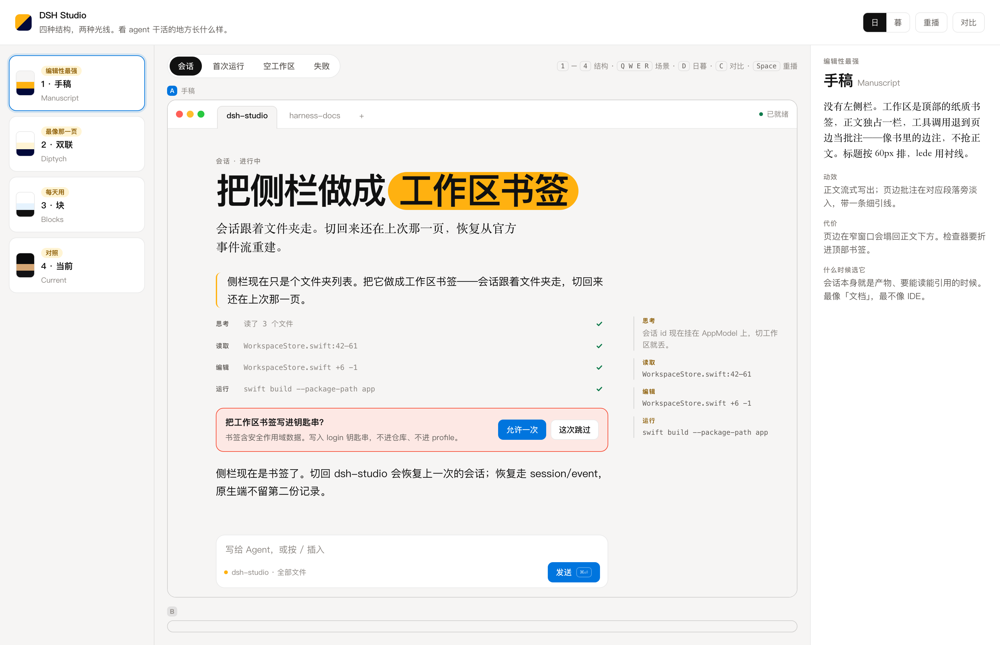
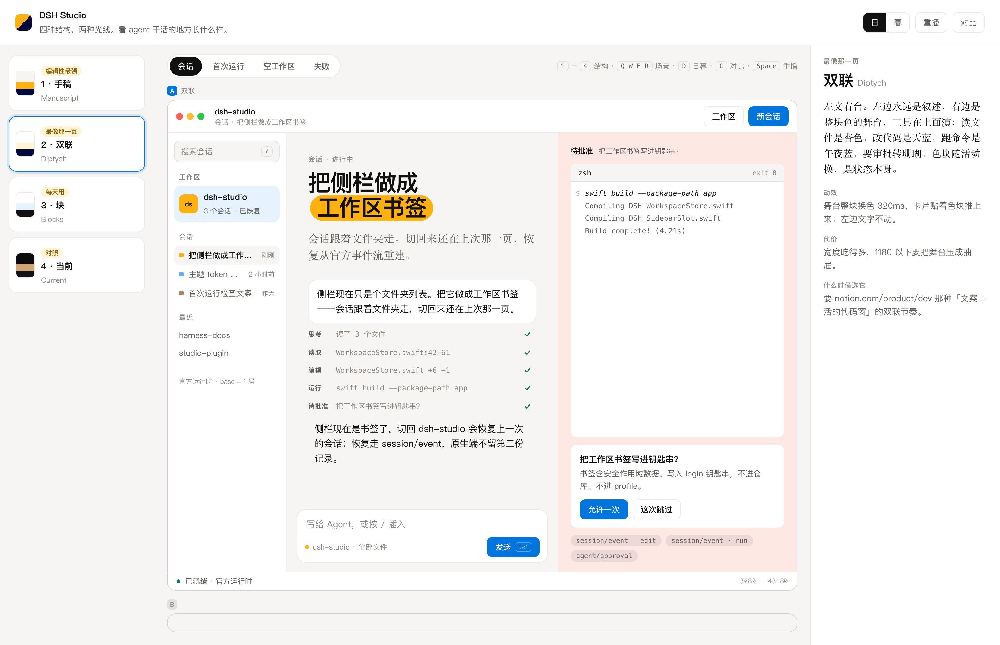
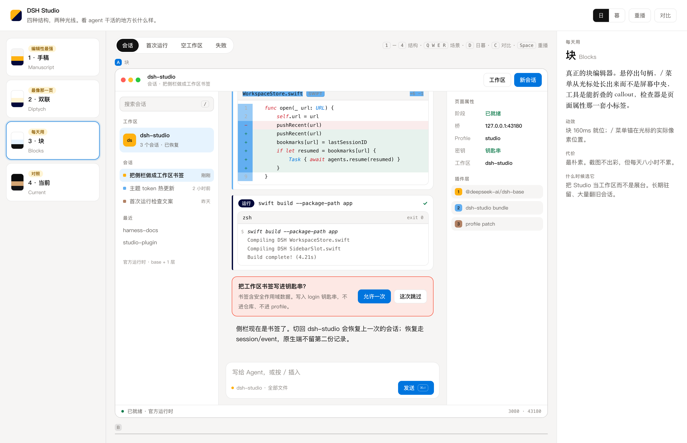
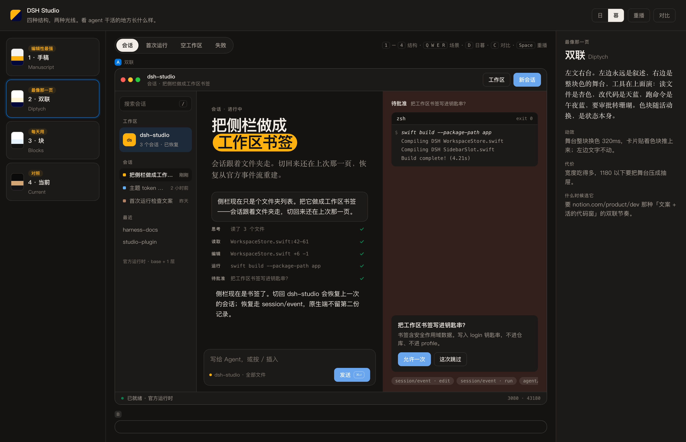

# DSH Studio · 设计现场

对齐 [Notion 开发者平台页](https://www.notion.com/zh-cn/product/dev) 的纸面语法：暖纸底、编辑性排版、色块当标点、代码窗是主角。不做命令面板 HUD。

```sh
open playground/index.html
```

或 `python3 -m http.server 4173 --directory playground`。

## 这次比的是结构，不是配色

四种结构渲染**同一份 agent transcript**——同一次「把侧栏做成工作区书签」：思考、读文件、改 diff、跑 `swift build`、要一次钥匙串批准、回话。所以差异全在版式和节奏上。

| 键 | 结构 | 工具调用去哪 | 选它的理由 |
| --- | --- | --- | --- |
| 1 | **手稿** Manuscript | 正文压成一行，详情去页边批注 | 会话本身是产物，要能读、能引用 |
| 2 | **双联** Diptych | 全部到右边的色块舞台上演 | 最像那一页的「文案 + 活的代码窗」 |
| 3 | **块** Blocks | 正文里的可折叠 callout | 每天八小时驻留，翻旧会话 |
| 4 | **当前** Current | 挤在中栏 | 只用来量差距 |

**日 / 暮**是正交的开关，不是第五种风格：同一套语法换光线。

### 手稿

没有左侧栏——工作区是顶部的纸书签。标题 56px，lede 用衬线，工具痕迹退到页边当边注。



### 双联

左边永远是叙述，右边是整块色的舞台。色随活动走：读文件杏色、改代码天蓝、跑命令午夜蓝、要审批转珊瑚——**色块就是状态**。批准的时候代码还留在台上，因为你要看着它决定。



### 块

真正的块编辑器：悬停出句柄，`/` 菜单锚在光标的实际像素位置，工具是能折叠的 callout，检查器是页面属性那一套小标签。



### 暮



## 快捷键

| 键 | 动作 |
| --- | --- |
| `1`–`4` | 换结构 |
| `Q W E R` | 会话 / 首次运行 / 空工作区 / 失败 |
| `D` | 日 ↔ 暮 |
| `C` | 左右对比两种结构 |
| `Space` | 重播这一回合 |
| `/` | 在输入栏里从光标处插入 |

对比时先点窗口 A 或 B，再点左边的结构卡。地址栏 hash 会记住当前组合，可以直接把链接发出来。

## 文件

| 文件 | 内容 |
| --- | --- |
| `transcript.js` | agent 回合数据、四个场景的文案、`/` 菜单项 |
| `playground.js` | 四种结构的渲染、播放器、光标锚定 |
| `playground.css` | 纸面 token、日/暮、代码窗与 diff |
