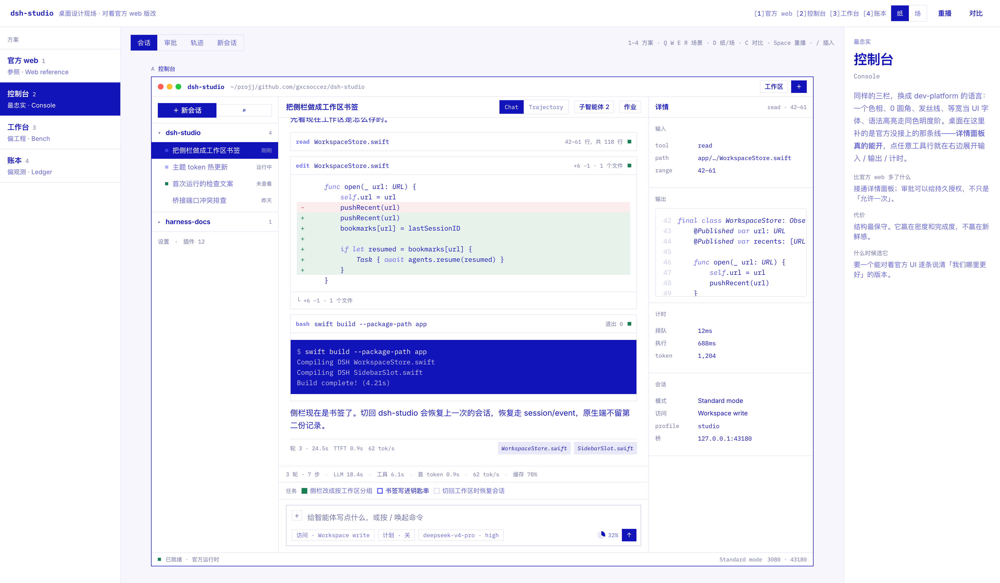
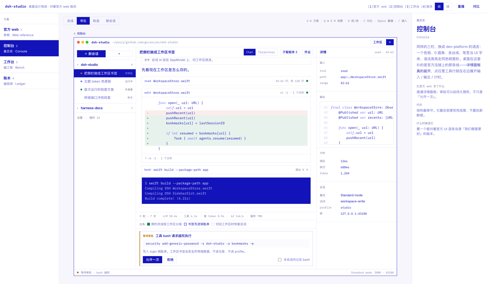
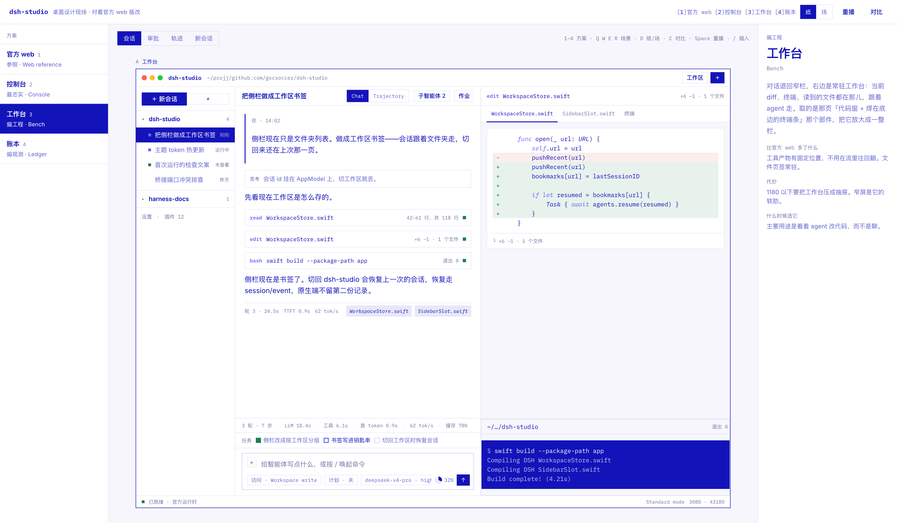
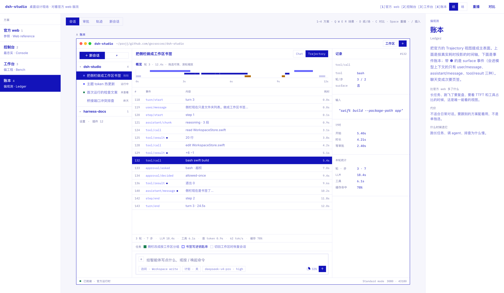
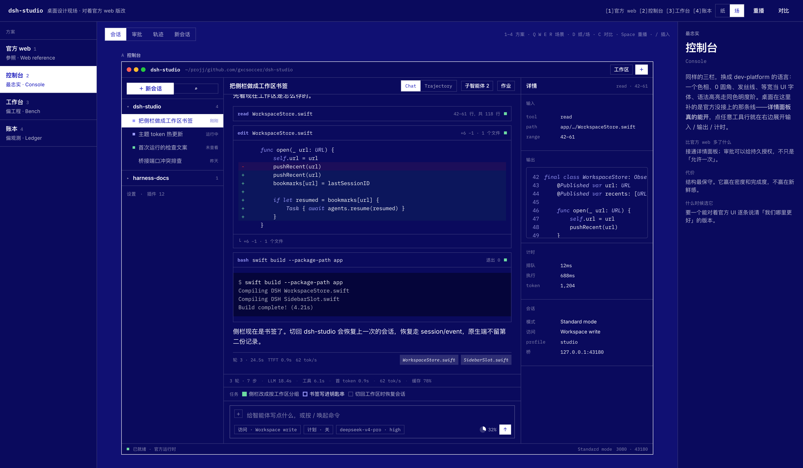
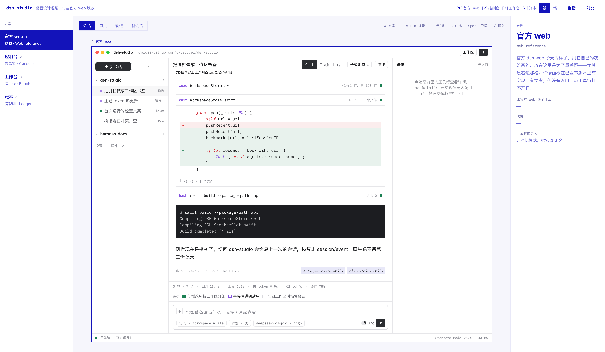

# DSH Studio · 桌面设计现场

```sh
open playground/index.html          # 或 python3 -m http.server 4173 --directory playground
```

四个方案渲染**同一次真实形状的会话**。参照的是 DeepSeek Harness 官方 web 客户端的实际表面，视觉语言取自 [notion.com/product/dev](https://www.notion.com/zh-cn/product/dev)。

## 两个前提，先说清楚

**一、那页不是 Notion 主站那套。** `/product/dev` 是一层 campaign theme，几乎把基础设计系统全覆盖了。实测下来：

| | Notion 主站 | `/product/dev` |
| --- | --- | --- |
| 底色 | 暖纸 `#f6f5f4` | 白 + `#F6F6FC`，hero/footer 整块 `#1313BA` |
| 色 | 万寿菊 / 珊瑚 / 天蓝轮换 | **一个色相十个值**，没有真中性色 |
| 正文 | 灰 `#615d59` | **品牌蓝 66% 透明** `#1313BAA8` |
| 圆角 | 卡片 12px、按钮 8px | **全部 0**，只有代码框留 4px |
| 阴影 | 发丝线为主 | **显式归零**，整页只有一种线色 `#CBCBEF70` |
| 字 | Inter + Lyon Text 衬线 | Inter + **iA Writer Mono**，等宽当 UI 字体 |
| 标题 | 动词裹彩色药丸 | 纯文本，单句带句号，靠 54px/700/−1.875px 字距 |
| 语法高亮 | 默认彩虹 | 重映射成**同色四级明度阶**，只有关键字跳霓虹 |
| 动效 | 弹性角色动画 | 只演产品在工作，**整页没有一处滚动淡入** |

上一版我照搬了左边那列，所以怎么调都不对。这一版按右边那列做，等宽用 IBM Plex Mono 代 iA Writer Mono。

**二、官方 web 版的交互是有定数的**，不能凭空想。已核对进来的：

- 三栏可拖拽，中栏最小 **640px**，侧栏 264–420（收起 56，视口 <1024 自动收），详情 300–520
- 双视图页签 **Chat / Trajectory**；Trajectory 是带时间轴的事件账本，不是日志堆
- **审批接管输入栏**，不是流里的卡片；只有「允许一次 / 拒绝」，**没有持久授权**
- composer 底部一排：访问模式、计划、模型·思考强度、上下文占用环、发送/停止
- 输入栏上方三层 dock：任务 → 目标 → 排队；再上面是统计条
- 侧栏状态点分优先级：**待交互（琥珀）> 运行中（蓝）> 未查看完成（绿）**
- 上下文占用、统计、任务、权限都是宿主算好的投影，客户端不自己折叠
- `/` 触发命令与技能，`@` 触发子智能体
- 44 种事件里只有 3 种是 surface（`user/message`、`assistant/message`、`tool/result`），账本里带 ● 的就是它们
- **详情面板在发布版里没有入口**——`openDetails` 有实现，但没人调用

最后一条是桌面最直接的机会，所以三个桌面方案都把它接上了。

## 四个方案

| 键 | 方案 | 右栏是什么 | 比官方 web 多了什么 |
| --- | --- | --- | --- |
| 1 | **官方 web** | 详情面板（打不开） | 参照系，用来量差距 |
| 2 | **控制台** | 真的能开的详情面板 | 点工具行就展开输入/输出/计时；审批可给持久授权 |
| 3 | **工作台** | 常驻工作面：diff、终端、文件页签 | 工具产物有固定位置，不用回流里翻 |
| 4 | **账本** | 记录检视器 | Trajectory 提为主表面，看 TTFT 和工具占比 |

**纸 / 场**是正交开关：场 = 把蓝底翻过来，就是那页 hero/footer 的做法，不是灰黑夜间模式。

### 控制台



### 审批接管输入栏

琥珀只做信号——一条左边和一个标签，不铺成色块。右下角那个「本会话内记住 bash」是官方 web 没有的。



### 工作台

对话退回窄栏；右边是常驻工作面，终端焊在代码窗底边，取自那页的部件。



### 账本



### 场



### 官方 web 参照



## 快捷键

| 键 | 动作 |
| --- | --- |
| `1`–`4` | 换方案 |
| `Q W E R` | 会话 / 审批 / 轨迹 / 新会话 |
| `D` | 纸 ↔ 场 |
| `C` | 对比两个方案 |
| `Space` | 重播这一轮 |
| `/` | 从光标处唤起命令与技能 |

对比时先点 A 或 B 窗再选方案。hash 记得住组合，链接可直接发。

## 文件

| 文件 | 内容 |
| --- | --- |
| `transcript.js` | 会话数据、工作区、事件账本、`/` 候选 |
| `playground.js` | 四个方案的组装、播放、光标锚定 |
| `playground.css` | dev-platform token、纸/场、代码窗与语法阶 |
