# DSH Studio · 桌面设计现场

```sh
open playground/index.html          # 或 python3 -m http.server 4173 --directory playground
```

两个轴：**皮肤**（视觉语言，6 套）×**结构**（三栏怎么排，3 种）。所有组合渲染同一次会话，所以比的只是设计本身。

会话内容按官方 `dsh web` 客户端的真实模型建：读文件 → 改 diff → 跑 build → 要一次钥匙串审批 → 回话。

## 窗体不是一张框格网

上一版每样东西都描了一圈边——标题栏、侧栏、每个工具行、每个代码框、输入栏、状态条——内边距 6–10px，字号从头到尾 11–14px。那是把 marketing page 的规则（0 圆角、零阴影、只用发丝线）原样搬到桌面上的结果：那页的教训是**克制**，不是那几条具体规则，桌面上没有材质和留白，克制就只剩寒酸。

现在按三个高度分层：

| 层 | 是什么 |
| --- | --- |
| **底场** | 窗体本身。侧栏和右栏直接坐在上面，没有竖分割线 |
| **画布** | 内容浮起的那一张，有圆角和柔和高度 |
| **浮层** | 输入栏单独一层；`/` 菜单和右栏卡片同层 |

分组靠留白和材质，不靠给每样东西描边。框线砍掉约六成，画布内边距 26–30px，会话标题放到 19–23px——整个窗口唯一让排版放开的地方是新会话页。

## 蓝色 = 模型在动

DeepSeek 品牌色是 **`#4D6BFE`**，单色、无渐变。它没有被铺满，而是拿到了一条规则：

> 品牌蓝只出现在模型正在动的地方。

具体就这几处：流式光标、正在跑的工具左侧那根轨、上下文占用环的已用弧、发送键、焦点环。别处一律不给。

所以 agent 闲着的时候整个窗口是全无彩的，一开始干活才泛蓝——隔着房间瞟一眼就知道它在不在跑。这也顺带解决了 `docs/theming.md` 里「One accent」那条：基座无彩，主题包换的就是这一个 live 色。仪器和磷光保留自己的口音（橙、琥珀），因为那是它们的身份。

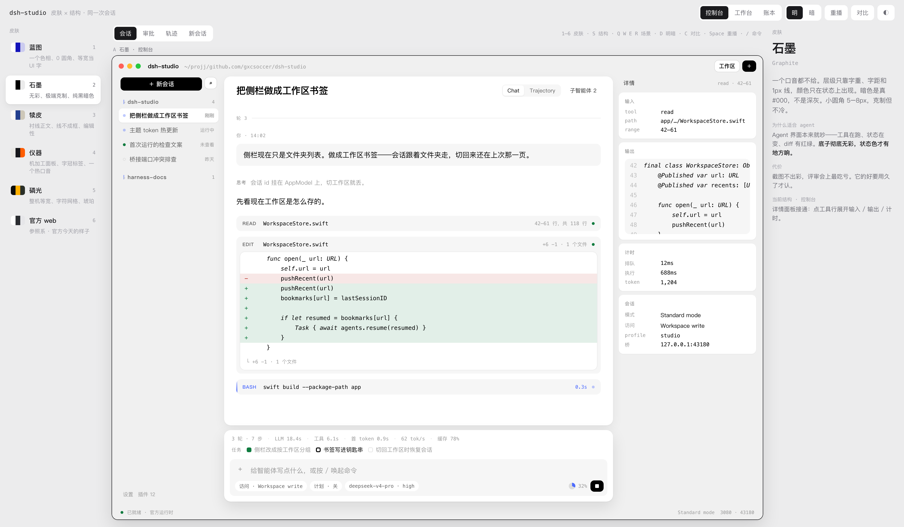

上图是跑到一半：只有 `bash` 那行有蓝——蓝轨、蓝标签、活着的计时器；发送键已经收成停止方块；上面跑完的两个工具全部退回中性。

### 微动效清单

都不是装饰，每个都在说一件事。

| 动效 | 说的是什么 |
| --- | --- |
| 工具左轨的行进光 | 正在跑，而且有方向感——比转圈安静 |
| 活的计时器 → 最终耗时 | 同一个位置，跑完不跳位 |
| 上下文环从 0 填到实际值 | 整个窗口唯一一张图表，只在挂载时走一次 |
| 流式光标 | 全段文字里唯一带品牌色的东西，写完就收 |
| 发送键 ↑ 收成方块 | 同一个键既是发送也是停止，不换位置 |
| 状态点两种呼吸频率 | 运行中 1.4s、待交互 2.6s，余光就能分开 |
| diff 改动行错峰落位 | 34ms 一档，读得出改了几处 |
| 悬停出「详情 →」 | 不占常驻位置 |
| 轮次分隔的极小编号 | 长会话里用来定位 |

## 皮肤

每套都有自己的签名，不是换配色。

### 1 蓝图 Blueprint

[notion.com/product/dev](https://www.notion.com/zh-cn/product/dev) 那层 campaign theme 的做法，换成 DeepSeek 的色相：**一个色相拉出十个值**，正文是深蓝而不是灰；0 圆角，代码框留 4px；语法高亮是同色四级明度阶，只有关键字跳到 `#4D6BFE`。

**为什么适合 agent**：要同时摆 prose、diff、终端三种东西。同一个色相做完全部层级，代码块就不会像贴进来的第三方组件。

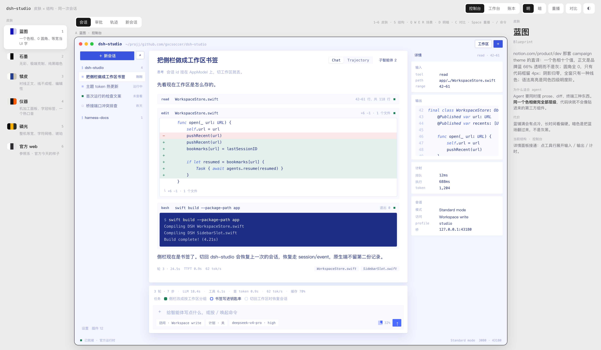

### 2 石墨 Graphite

一个口音都不给。层级只靠字重、字距和 1px 线，颜色只在状态上出现。暗色是真 `#000`。

**为什么适合 agent**：界面本来就吵——工具在跑、状态在变、diff 有红绿。底子彻底无彩，状态色才有地方响。

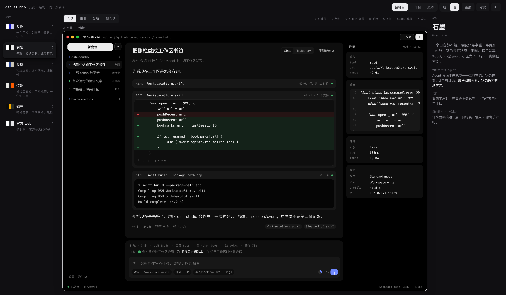

### 3 犊皮 Vellum

把会话当印出来的文稿：暖白纸、衬线正文 16px/27px、卡片退成规则线（工具行只有一条上边）、代码窗不围框只留一条左规则。深墨蓝是唯一动作色。

**为什么适合 agent**：会话本身就是文档——要读、要引用、要归档。

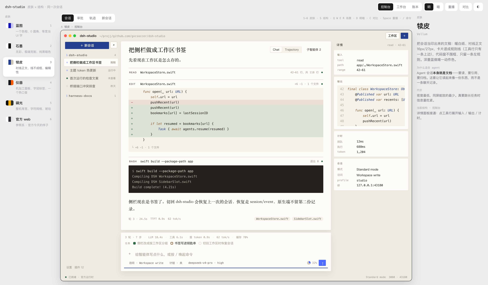

### 4 仪器 Instrument

Braun / TE 那一路：2px 机加工圆角、9px 全大写 0.13em 字距的标签、数字全等宽且表格对齐、方点不是圆点。橙色只给「哪儿在动、哪儿能按」。

**为什么适合 agent**：这是一台驱动 agent 的仪器。热口音只标一件事，一眼知道该看哪。

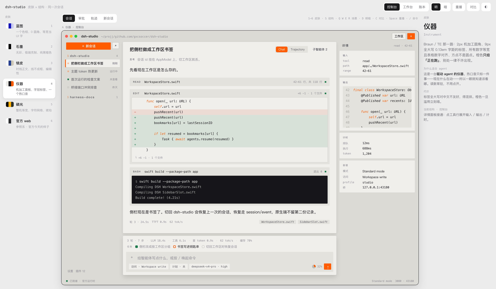

### 5 磷光 Phosphor

把终端做好看，而不是做旧。全窗等宽、行高锁 20px 对齐字符格、方点、块状光标、琥珀单口音。不加扫描线、不做拟物。

**为什么适合 agent**：它的主业就是跑 shell、改文件。终端美学不是隐喻，是真实工作面。

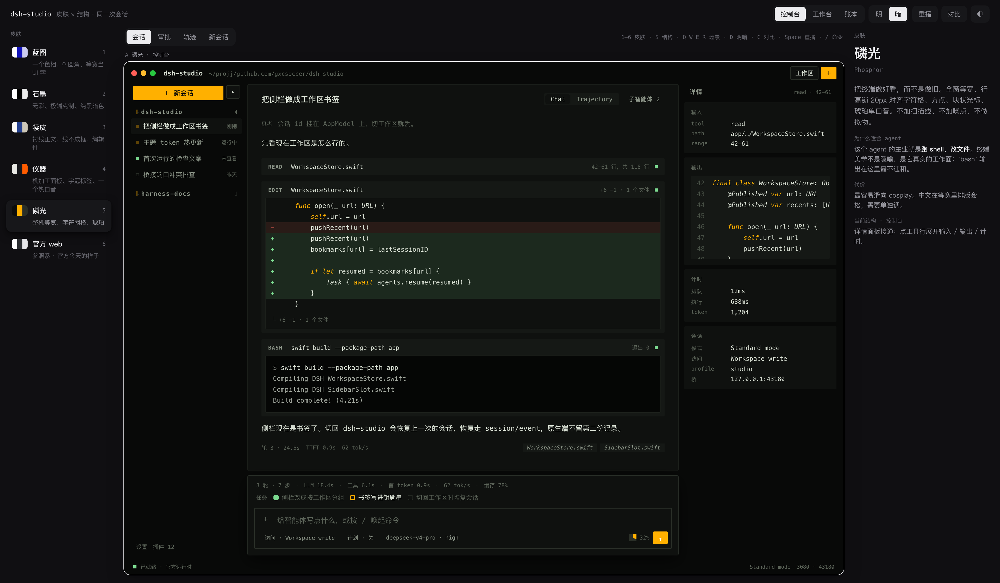

### 6 官方 web

参照系。右栏那个详情面板**在发布版里没有入口**——`openDetails` 有实现但无人调用。其余五套都接上了。

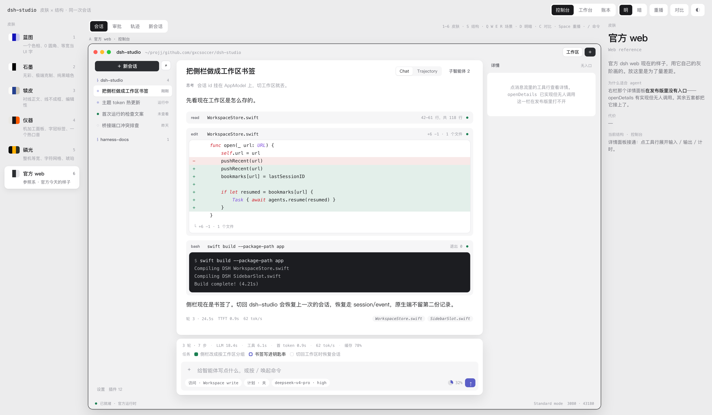

## 结构

| 键 | 结构 | 右栏 |
| --- | --- | --- |
| S | **控制台** | 接通的详情面板：点工具行展开输入 / 输出 / 计时 |
| S | **工作台** | 常驻工作面：diff、终端、文件页签 |
| S | **账本** | Trajectory 提为主表面，时间轴按真实耗时投影 |

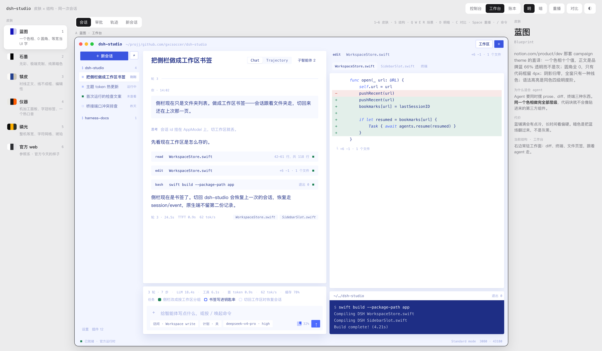

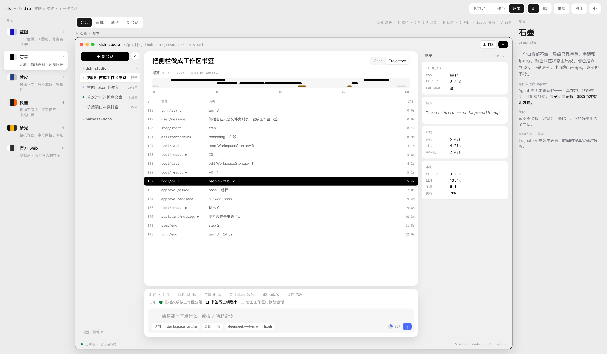

## 审批

官方是**接管输入栏**，不是流里插卡片，而且只有「允许一次 / 拒绝」。桌面补了持久授权。

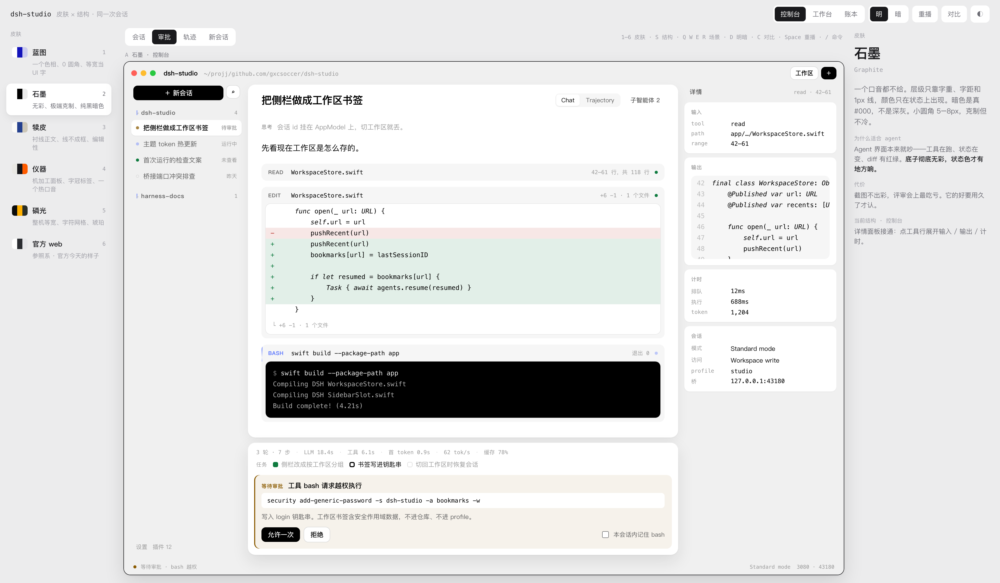

## 新会话

整个窗口唯一让排版放开的地方。46px 衬线标题坐在空画布上。

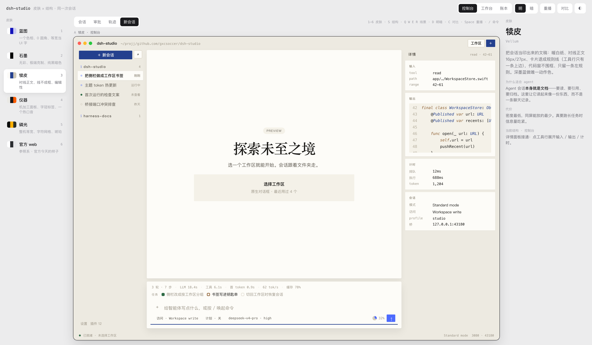

## 对着 harness 核过的交互

三栏可拖拽（中栏最小 640）· Chat / Trajectory 双视图 · 审批接管输入栏 · composer 底部访问模式 / 计划 / 模型 / 上下文环 · 任务→目标→排队三层 dock · 侧栏状态点分优先级（待交互 > 运行中 > 未查看完成）· 上下文与统计是宿主投影 · `/` 唤起命令与技能 · 44 种事件里只有 3 种是 surface。

## 快捷键

| 键 | 动作 |
| --- | --- |
| `1`–`6` | 换皮肤 |
| `S` | 轮换结构 |
| `Q W E R` | 会话 / 审批 / 轨迹 / 新会话 |
| `D` | 窗口明暗 |
| `C` | 对比两套皮肤 |
| `Space` | 重播 |
| `/` | 从光标处唤起命令 |

右上角 `◐` 单独切 playground 外壳的明暗——外壳固定中性，不跟皮肤走，方便比皮肤。hash 记得住组合。
