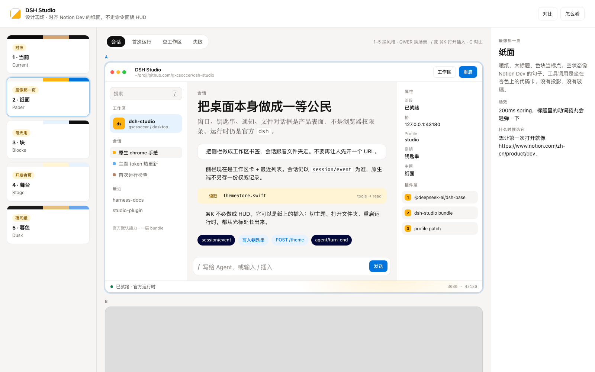
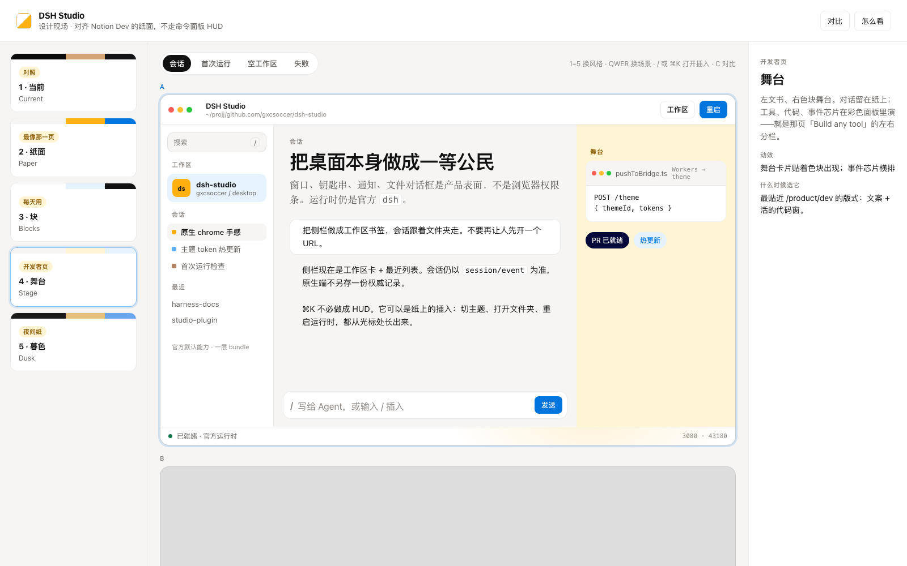

# DSH Studio · Design Playground

对齐的是 [Notion 开发者平台页](https://www.notion.com/zh-cn/product/dev) 的纸面气质，**不是 Raycast 那套玻璃 HUD**。

```sh
open playground/index.html
```

或：

```sh
python3 -m http.server 4173 --directory playground
```

然后打开 `http://127.0.0.1:4173`。

## 五套，同一家族里做选择

| 键 | 方向 | 一句话 |
| --- | --- | --- |
| 1 | **当前** | 现有 Studio Dark，只作对照 |
| 2 | **纸面 Paper** | 最像那一页：暖纸、大标题、动词药丸、杏色代码卡 |
| 3 | **块 Blocks** | Notion 工作区：句柄、/ 插入、callout、页面属性 |
| 4 | **舞台 Stage** | /product/dev 的左右分栏：左文书，右色块里演工具 |
| 5 | **暮色 Dusk** | 同一套纸面语法的夜间暖炭，不是 OLED 玻璃 |

没有命令面板悬浮舱、没有网格蓝图、没有赛博描边。快捷检索做成纸上的插入，不是 HUD。

预览（会话场景）：

| 纸面 | 块 | 舞台 |
| --- | --- | --- |
|  |  |  |

## 快捷键

| 键 | 动作 |
| --- | --- |
| `1`–`5` | 切换风格 |
| `Q` `W` `E` `R` | 会话 / 首次运行 / 空工作区 / 失败 |
| `/` 或 `⌘K` | 插入 / 检索 |
| `Esc` | 关闭 |
| `C` | 对比两套 |

对比时先点窗口 A 或 B，再点左侧风格卡。
